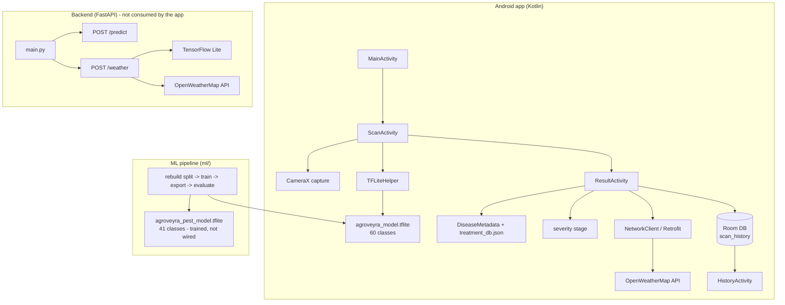
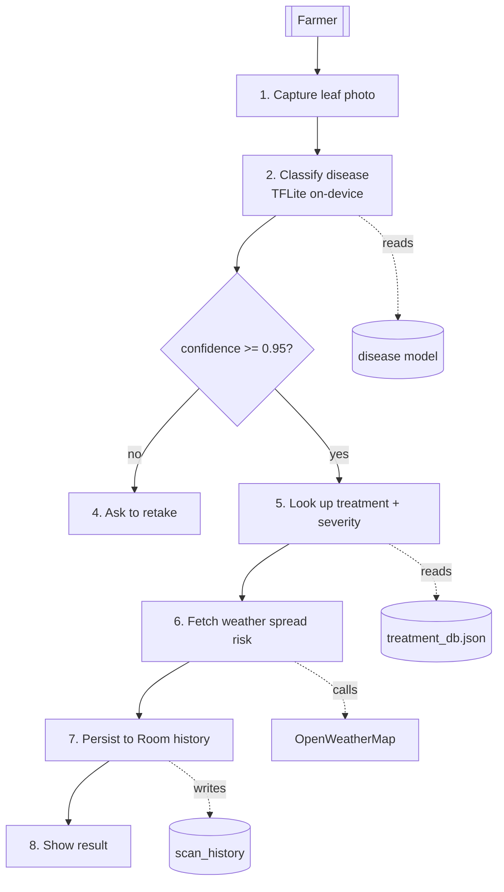
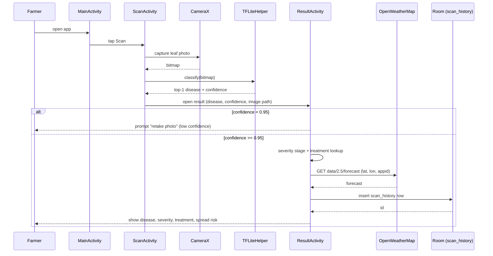
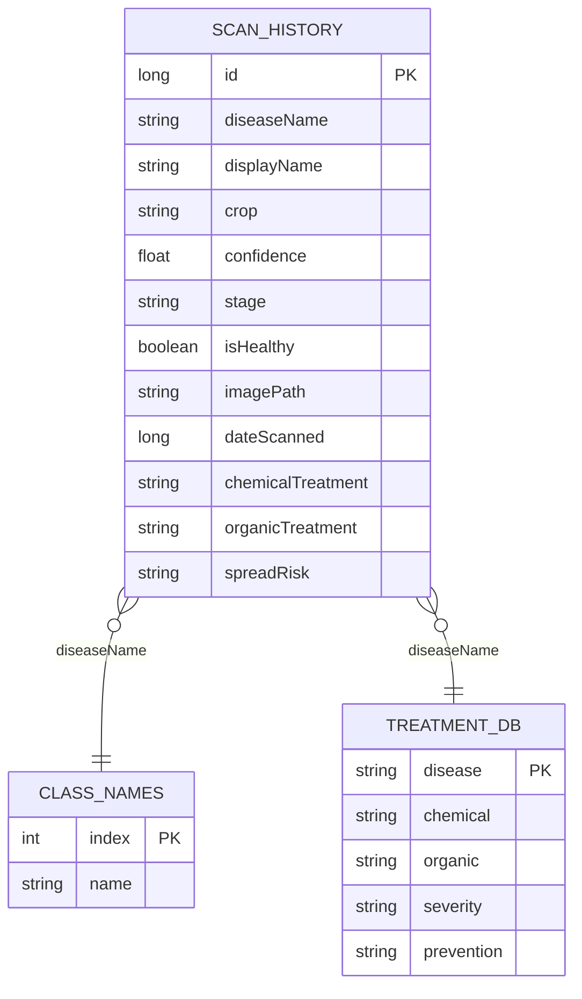
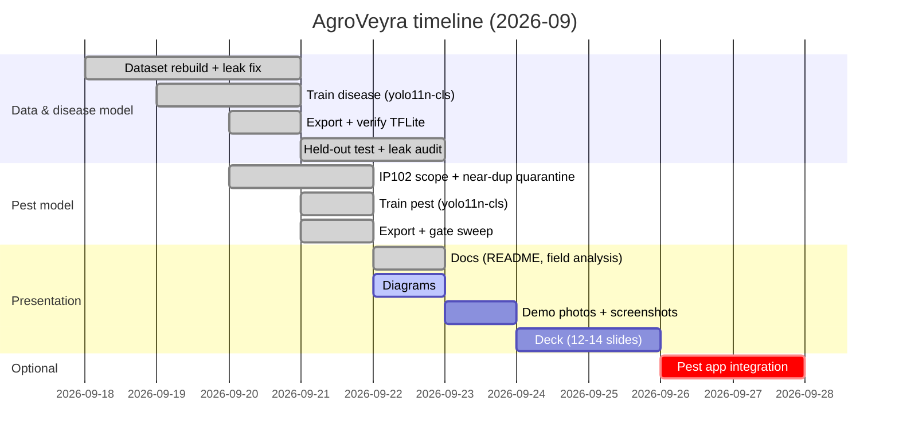

# AgroVeyra — System Diagrams

All diagrams are Mermaid. Render with any Mermaid viewer (GitHub, VS Code Markdown preview, mermaid.live).

> Architecture note that matters for a reviewer: the Android app is **fully on-device** for inference and
> calls **OpenWeatherMap directly** (not the backend). The FastAPI backend is a parallel service that
> mirrors `/predict` and `/weather` but is **not consumed by the app** as shipped.

## 1. Architecture



## 2. Use-case

```mermaid
flowchart LR
    U((Farmer)) --> A[Scan a leaf]
    U --> B[View disease, confidence, severity]
    U --> C[View chemical + organic treatment]
    U --> D[Check disease spread risk (weather)]
    U --> E[View / reopen scan history]
    A -.->|primary flow| APP[AgroVeyra app]
    B -.-> APP
    C -.-> APP
    D -.-> APP
    E -.-> APP
    A -.->|if confidence < 0.95| R[Retake photo prompt]
```

## 3. DFD — level 0 (context)

```mermaid
flowchart LR
    USER[[Farmer]] -->|photo, taps| APP[AgroVeyra App]
    APP -->|diagnosis + treatment + risk| USER
    APP -->|latitude, longitude| OWM[OpenWeatherMap]
    OWM -->|forecast| APP
    APP -->|(alternative mirror)| BE[Backend FastAPI]
```

## 4. DFD — level 1 (app)



## 5. Sequence — scan flow



## 6. ER — persistence

Room table `scan_history` plus the two JSON lookup assets (`treatment_db.json`, `class_names.json`),
which are read-only assets keyed by disease name rather than foreign-keyed tables.



## 7. Gantt — project timeline



