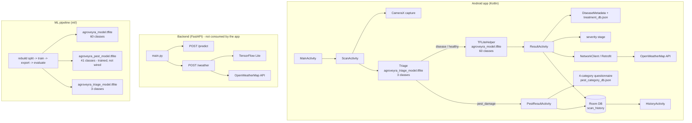
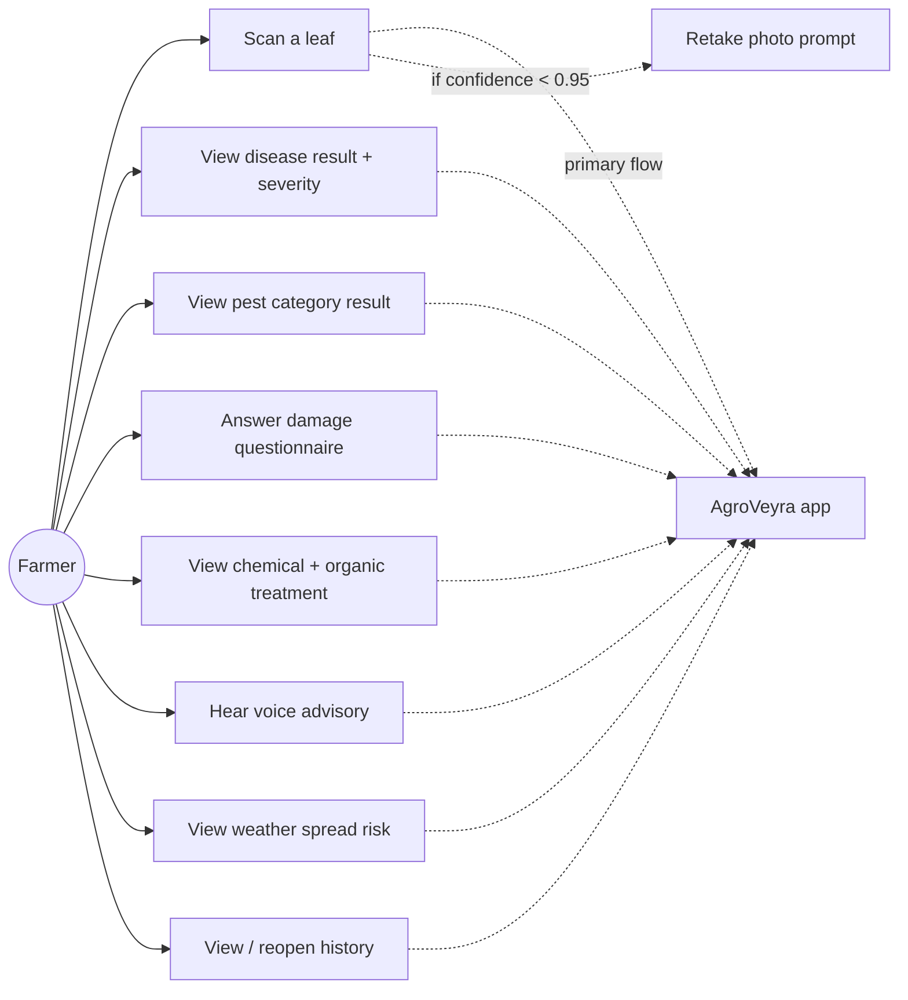
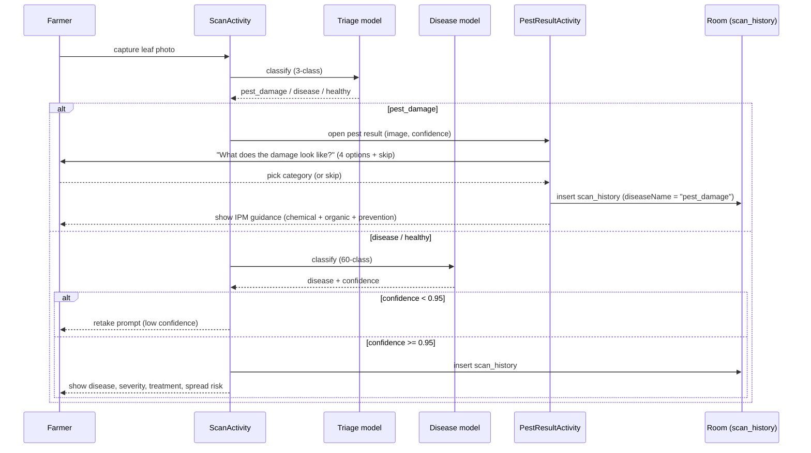
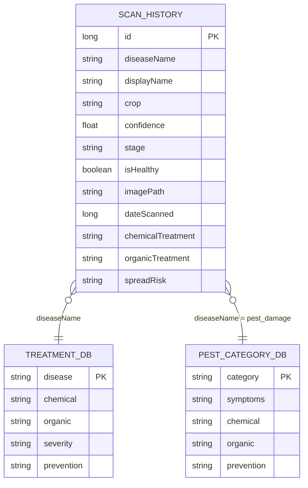
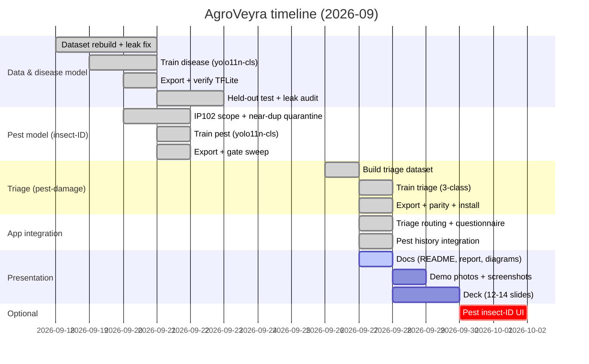

# AgroVeyra — System Diagrams

All diagrams are Mermaid. Render with any Mermaid viewer (GitHub, VS Code Markdown preview, mermaid.live).

> Architecture note that matters for a reviewer: the Android app is **fully on-device** for inference and
> calls **OpenWeatherMap directly** (not the backend). The FastAPI backend is a parallel service that
> mirrors `/predict` and `/weather` but is **not consumed by the app** as shipped.

## 1. Architecture — three on-device models



## 2. Use-case



## 3. DFD — level 0 (context)

```mermaid
flowchart LR
    USER[[Farmer]] -->|photo, taps| APP[AgroVeyra App<br/>3 on-device models]
    APP -->|diagnosis + treatment + risk| USER
    APP -->|latitude, longitude| OWM[OpenWeatherMap]
    OWM -->|forecast| APP
    APP -->|(alternative mirror)| BE[Backend FastAPI]
```

## 4. DFD — level 1 (app)

```mermaid
flowchart TB
    U[[Farmer]] --> P1[1. Capture leaf photo]
    P1 --> P2[2. Triage: healthy / disease / pest_damage]
    P2 --> P2a{which class?}
    P2a -->|pest_damage| P3[3. Pest questionnaire -> IPM guidance]
    P2a -->|disease / healthy| P4[4. Disease classifier (60-class)]
    P4 --> P5[5. Look up treatment + severity]
    P5 --> P6[6. Fetch weather spread risk]
    P6 --> P7[7. Persist to Room history]
    P7 --> P8[8. Show result]
    P3 --> P7
    P2 -.reads.-> TRI[(triage model)]
    P4 -.reads.-> DM[(disease model)]
    P3 -.reads.-> PCD[(pest_category_db.json)]
    P5 -.reads.-> TD[(treatment_db.json)]
    P6 -.calls.-> OWM[OpenWeatherMap]
    P7 -.writes.-> RH[(scan_history)]
```

## 5. Sequence — scan flow with triage branch



## 6. ER — persistence

Room table `scan_history` plus three JSON lookup assets (`treatment_db.json`, `pest_category_db.json`,
`class_names.json`), which are read-only assets keyed by name rather than foreign-keyed tables.
Pest entries reuse the same table: `diseaseName = "pest_damage"` and `displayName` holds the category.



## 7. Gantt — project timeline

